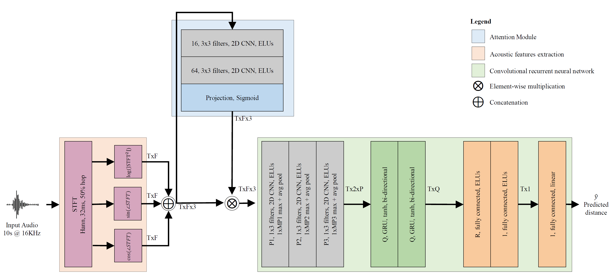

# Single-Channel Speaker Distance Estimation



Repository for estimating how far a talker is from a
microphone from **one channel** of reverberant speech.

## Start here

| | Study | Question | Venue |
|---|---|---|---|
| 🔬 | [**`papers/rir-analysis`**](papers/rir-analysis/) | Which parts of the room impulse response actually carry distance information? | IWAENC 2026 |
| 🎯 | [**`papers/calibration`**](papers/calibration/) | What minimal labelling makes a synthetic-trained estimator usable on real data? | under review |

```bash
pip install -e .
python scripts/check_reproduction.py    
```

## History

The earlier stage of this project (WASPAA 2023, TASLP 2024) evaluated on a synthetic
benchmark in which every clip was aligned to the true propagation delay at a fixed
source level — effectively assuming the microphone and the loudspeaker are
**synchronised**, so the time of flight is directly observable.

That assumption rarely holds in the wild. A recording seldom begins at a known instant
relative to when the talker started speaking, and the source level is not known either.
Once it is dropped, the question changes: how much distance information does the
reverberation itself carry?

The current datasets answer that by removing each cue explicitly:

| configuration | timing cue | level cue | corresponds to |
|---|---|---|---|
| `synthetic_baseline` | available | available | the time-calibrated case (stage 1) |
| `synthetic_gain_var` | available | **removed** | known timing, unknown level |
| `synthetic_onset_randomized` | **removed** | available | unknown timing, known level |
| `synthetic_both` | **removed** | **removed** | the realistic, uncalibrated case |

Crossed with four room-impulse-response variants (`full`, `direct` only, `no_early`,
`no_late`), that gives sixteen paired signals per acoustic scene — same room, same
talker, same distance — so a difference in performance is attributable to exactly one
manipulation.

> 📦 **Earlier work:** [`papers/estimation-2023-2024`](papers/estimation-2023-2024/)
> holds the WASPAA 2023 and TASLP 2024 code, still reproducible. Its reported figures
> describe the time-calibrated setting.

## Instructions

- 📁 **src/speaker_distance** (shared implementation)
  - 📄 models/seldnet.py (canonical network + Lightning wrapper)
  - 📄 models/compat.py (loads checkpoints from either naming era)
  - 📄 paths.py (resolves data locations; `SPEAKER_DISTANCE_*` to override)
  - 📄 loggers.py (CSV by default — no account needed)
- 📁 **papers/rir-analysis** — *IWAENC 2026*
  - 📄 generate_all_datasets.py (regenerates the corpus; `--out`, `--overwrite`)
  - 📄 data.py, model.py, train_val_test.py
  - 🔢 sweep_summary.csv, variant_results.csv (published numbers)
  - 🔢 data/folds5.csv (5-fold split — **use this one**)
- 📁 **papers/calibration** — *under review*
  - 📄 few_shot_calibration.py, run_calibration_variants.py, calib_*.py
  - 📄 eval_*.py (regenerate the per-sample results)
  - 🔢 calib_variants_results.csv, noisy_summary*.csv, real_data_summary.csv
- 📁 **papers/estimation-2023-2024** — *WASPAA 2023, TASLP 2024 (earlier work)*
- 📁 **data/labels** (distance annotations for the real corpora)
- 📁 **tests** (model equivalence), 📁 **scripts** (reproduction checker)
- 📄 requirements.txt, 📄 pyproject.toml


## Datasets

### 📥 Download

The synthetic corpus (40,000 clips, 16 paired variants per scene), the STARSS23
distance subset, and all annotations and splits are published as one citable record:

> **Zenodo: [10.5281/zenodo.TODO](https://doi.org/10.5281/zenodo.TODO)** — ~26 GB,
> CC BY-NC 4.0

The record's own description documents the variants, the metadata schema, the realised
statistics and the folds. Unpack it anywhere and point `SPEAKER_DISTANCE_PUBLISH` at it.

### Obtained separately

Three sources cannot be redistributed:

| Corpus | Where | Note |
|---|---|---|
| **QMULTIMIT** | needs an LDC TIMIT licence + the QMUL RIRs | [`qmultimit_labels.csv`](data/labels/qmultimit_labels.csv) fully determines reconstruction |
| **VoiceHome-2** | [Zenodo](https://zenodo.org/records/1252143) | split definition ships with our record |
| **Noise** | [WHAM!](http://wham.whisper.ai/) | segmentation in [`noise_whamr_manifest.csv`](data/labels/noise_whamr_manifest.csv) |

### Telling the code where things are

No placeholder folders to fill — set an environment variable:

| variable | holds |
|---|---|
| `SPEAKER_DISTANCE_PUBLISH` | the downloaded Zenodo corpus |
| `SPEAKER_DISTANCE_SYNTH` | the synthetic corpus (defaults to the above) |
| `SPEAKER_DISTANCE_DATA` | QMULTIMIT, VoiceHome-2 |
| `SPEAKER_DISTANCE_NOISE` | WHAM!-derived noise splits |
| `SPEAKER_DISTANCE_WHAM48` | WHAM! at 48 kHz, for the 0 dB evaluations |
| `SPEAKER_DISTANCE_EARS` | EARS speech, for corpus regeneration only |

Expected layout under `SPEAKER_DISTANCE_DATA`:

```
QMULTIMIT/{train,val,test}/*.wav
VoiceHome2/voiceHome-2_corpus_1.0/{annotations,audio}/...
```

Check what resolved where, and which paths hold data:

```bash
python -m speaker_distance.paths
```

> ⚠️ **Code and data are licensed separately.** The code is MIT. The datasets are
> **CC BY-NC 4.0**, inherited from their sources: the synthetic audio derives from EARS
> and the noise from WHAM!, both non-commercial.

## Authors

Michael Neri*, Archontis Politis*, and Tuomas Virtanen*

\*Faculty of Information Technology and Communication Sciences, Tampere University, Finland


## Citation


```bibtex
@ARTICLE{Neri_TASLP_2024,
  author={Neri, Michael and Politis, Archontis and Krause, Daniel A. and Carli, Marco and Virtanen, Tuomas},
  journal={IEEE/ACM Transactions on Audio, Speech, and Language Processing},
  title={{Speaker Distance Estimation in Enclosures from Single-Channel Audio}},
  year={2024},
  volume={32},
  pages={2242-2254},
  doi={10.1109/TASLP.2024.3382504}
}

@INPROCEEDINGS{Neri_WASPAA_2023,
  author={Neri, Michael and Politis, Archontis and Krause, Daniel A. and Carli, Marco and Virtanen, Tuomas},
  booktitle={2023 IEEE Workshop on Applications of Signal Processing to Audio and Acoustics (WASPAA)},
  title={{Single-Channel Speaker Distance Estimation in Reverberant Environments}},
  year={2023},
  pages={1-5},
  doi={10.1109/WASPAA58266.2023.10248087}
}
```

```bibtex
@INPROCEEDINGS{Neri_IWAENC_2026,
  author={Neri, Michael and Politis, Archontis and Virtanen, Tuomas},
  booktitle={18th International Workshop on Acoustic Signal Enhancement (IWAENC)},
  title={{Dependence on Early and Late Reverberation of Single-Channel Speaker Distance Estimation}},
  year={2026},
  pages={1-5},
  doi={}
}

@article{neri2026few,
  title={Few-Shot Calibration for Sim-to-Real Single-Channel Speaker Distance Estimation},
  author={Neri, Michael and Politis, Archontis and Virtanen, Tuomas},
  journal={arXiv preprint arXiv:2609.29203},
  year={2026}
}
```
